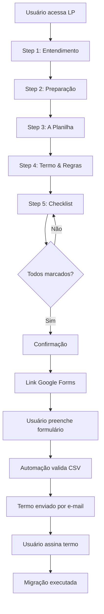

# Guia de Migração RA Reviews - Documentação Técnica

## 📋 Visão Geral

A **Landing Page de Migração de Reviews** é uma aplicação web desenvolvida para guiar clientes da RA Reviews através do processo de migração de reviews entre plataformas de e-commerce. A aplicação oferece um wizard interativo passo a passo que explica o processo, valida dados e direciona o cliente para o formulário oficial de solicitação.

### Objetivo

Facilitar e automatizar o processo de migração de reviews, reduzindo o tempo de processamento de **60 dias** (processo manual) para **48-72 horas úteis** (processo automatizado), transferindo a responsabilidade de validação de IDs para o cliente, que possui conhecimento direto sobre seus produtos.

---

## 🏗️ Arquitetura e Tecnologias

### Stack Tecnológico

- **Framework**: React 18.2.0
- **Build Tool**: Vite 5.0.0
- **Linguagem**: TypeScript 5.2.2
- **Estilização**: CSS Variables + Tailwind CSS (via classes utilitárias)
- **Ícones**: Lucide React
- **Design System**: Trust-DS (customizado)

### Estrutura do Projeto

```
ra-reviews-migration-guide/
├── public/
│   └── assets/
│       └── ra-reviews-logo.png      # Logo da RA Reviews
├── src/
│   ├── App.tsx                      # Componente principal
│   ├── components/
│   │   ├── layout/                  # Componentes de layout
│   │   │   ├── Header.tsx           # Cabeçalho com logo e título
│   │   │   └── Sidebar.tsx           # Navegação lateral dos steps
│   │   ├── steps/                   # Componentes de conteúdo dos steps
│   │   │   ├── ContentSteps.tsx     # Steps 1-4 (conteúdo informativo)
│   │   │   └── StepUpload.tsx       # Step 5 (checklist e formulário)
│   │   └── ui/                      # Design System components
│   │       └── DesignSystem.tsx     # Componentes reutilizáveis
│   ├── constants/
│   │   └── migration.ts             # Constantes e configurações
│   ├── hooks/
│   │   └── useMigrationSteps.ts    # Hook customizado para gerenciar steps
│   ├── services/
│   │   └── csvValidator.ts          # Validação de arquivos CSV
│   ├── styles/
│   │   └── TrustDSStyles.tsx        # Estilos globais e variáveis CSS
│   └── types/
│       └── migration.ts             # TypeScript types e interfaces
├── index.html
├── index.tsx                        # Entry point
├── package.json
├── tsconfig.json
└── vite.config.ts
```

---

## 🎯 Funcionalidades Principais

### 1. Wizard de 5 Passos

A aplicação guia o usuário através de 5 etapas sequenciais:

#### **Step 1: Entendimento**
- Explica o conceito de migração de reviews
- Demonstra a lógica de IDs de produtos
- Apresenta quando fazer e quando não fazer migração
- Visualização comparativa entre plataformas antiga e nova

#### **Step 2: Preparação**
- Instruções para exportar dados do painel RA Reviews
- Avisos sobre não adicionar linhas novas
- Orientação para remover produtos novos da planilha

#### **Step 3: A Planilha**
- Regras detalhadas de preenchimento
- Exemplos visuais de cenários (troca simples, agrupamento, arquivamento)
- Tabela de exemplo completa
- Avisos sobre formatação no Excel

#### **Step 4: Termo & Regras**
- Explicação do fluxo automatizado
- Processo de validação interna
- Envio de termo por e-mail
- Necessidade de assinatura digital

#### **Step 5: Validar e Enviar**
- Checklist de prontidão (5 itens obrigatórios)
- Confirmação de responsabilidade
- Link para formulário Google Forms oficial
- Timeline visual do processo pós-envio

### 2. Navegação Intuitiva

- **Sidebar Desktop**: Navegação lateral com indicadores visuais de progresso
- **Progress Bar Mobile**: Barra de progresso horizontal em dispositivos móveis
- **Navegação Sequencial**: Botões "Voltar" e "Próximo" entre steps
- **Scroll Automático**: Scroll suave para o topo ao mudar de step

### 3. Validação de Checklist

O step final inclui um checklist interativo que deve ser completamente preenchido antes de prosseguir:

1. ✅ Planilha preenchida corretamente
2. ✅ IDs validados
3. ✅ Nova plataforma integrada
4. ✅ Produtos novos removidos
5. ✅ Ciente sobre assinatura do termo

### 4. Design System Trust-DS

A aplicação utiliza componentes customizados baseados no Design System Trust-DS:

- **DsButton**: Botões com variantes (primary, secondary, ghost, destructive)
- **DsCard**: Cards com sombras e bordas arredondadas
- **DsBadge**: Badges informativos
- **DsInput/Label**: Campos de formulário estilizados
- **DsH1/H2/P**: Tipografia consistente
- **DsTooltip**: Tooltips informativos

---

## 🔧 Componentes Principais

### `App.tsx`
Componente raiz que gerencia o estado global do wizard e renderiza a estrutura principal.

**Responsabilidades:**
- Gerenciar estado dos steps via hook customizado
- Renderizar Header, Sidebar e conteúdo dinâmico
- Controlar navegação entre steps

### `useMigrationSteps` Hook
Hook customizado que encapsula toda a lógica de gerenciamento de steps.

**Retorna:**
- `steps`: Array completo de steps configurados
- `currentStep`: Step atual (índice)
- `setCurrentStep`: Função para navegar para step específico
- `handleNext/handlePrev`: Funções de navegação
- `topRef`: Ref para scroll automático
- `progress`: Percentual de progresso (0-100)

### `StepUpload.tsx`
Componente do step final que gerencia o checklist e direciona para o formulário.

**Estados Internos:**
- `wizardStep`: Estado do sub-wizard (checklist → confirmation → final_link)
- `checks`: Estado dos checkboxes do checklist

**Fluxo:**
1. Checklist → Usuário marca todos os itens
2. Confirmation → Confirmação de responsabilidade
3. Final Link → Link para Google Forms + timeline

### `csvValidator.ts`
Serviço de validação de arquivos CSV.

**Funções:**
- `validateCSV()`: Valida estrutura e conteúdo do CSV
- `extractNewCodes()`: Extrai IDs novos únicos do CSV

**Validações:**
- Detecção de delimitador (vírgula ou ponto-e-vírgula)
- Verificação de colunas obrigatórias
- Detecção de IDs antigos duplicados
- Validação de códigos novos vazios

---

## 🎨 Design e UX

### Paleta de Cores

A aplicação utiliza variáveis CSS do Trust-DS:

- **Primary** (Verde): `#007535` - Ações principais, links
- **Secondary** (Verde claro): `#90b823` - Destaques, sucesso
- **Slate** (Cinza): `#62748E` - Textos, bordas, backgrounds
- **Yellow**: `#854D0E` - Avisos, alertas
- **Red**: `#DC2626` - Erros, ações destrutivas

### Responsividade

- **Desktop**: Layout com sidebar fixa à esquerda
- **Tablet**: Layout adaptado, sidebar colapsável
- **Mobile**: Barra de progresso horizontal, layout vertical

### Animações

- Transições suaves entre steps
- Animações de entrada (fade-in, slide-in)
- Hover states em elementos interativos
- Progress bar animada

---

## 📦 Dependências

### Produção
```json
{
  "lucide-react": "^0.292.0",  // Ícones
  "react": "^18.2.0",
  "react-dom": "^18.2.0"
}
```

### Desenvolvimento
```json
{
  "@types/react": "^18.2.37",
  "@types/react-dom": "^18.2.15",
  "@vitejs/plugin-react": "^4.2.0",
  "typescript": "^5.2.2",
  "vite": "^5.0.0"
}
```

---

## 🚀 Como Executar

### Pré-requisitos
- Node.js 18+ (recomendado: 22.20.0)
- npm ou yarn

### Instalação
```bash
npm install
```

### Desenvolvimento
```bash
npm run dev
```
A aplicação estará disponível em `http://localhost:5173`

### Build de Produção
```bash
npm run build
```
Os arquivos otimizados serão gerados em `dist/`

---

## 🔄 Fluxo do Usuário



---

## 📊 Métricas e Objetivos

### Objetivos de Negócio
- ✅ Reduzir tempo de migração de 60 dias para 48-72h úteis
- ✅ Transferir responsabilidade de validação para o cliente
- ✅ Reduzir carga de trabalho da equipe CS
- ✅ Melhorar experiência do cliente no processo

### KPIs Sugeridos
- Taxa de conclusão do wizard (conversão)
- Tempo médio de preenchimento
- Taxa de erro na validação de CSV
- Satisfação do cliente (NPS)

---

## 🛠️ Manutenção e Evolução

### Melhorias Futuras Sugeridas

1. **Validação em Tempo Real**
   - Upload de CSV no próprio wizard
   - Validação instantânea com feedback visual
   - Preview de erros antes do envio

2. **Integração com API**
   - Envio direto do CSV via API
   - Status de processamento em tempo real
   - Notificações push

3. **Histórico de Migrações**
   - Dashboard para acompanhar status
   - Histórico de migrações anteriores

4. **Suporte Multi-idioma**
   - Internacionalização (i18n)
   - Suporte para inglês e espanhol

5. **Acessibilidade**
   - Melhorias em ARIA labels
   - Navegação por teclado
   - Suporte a leitores de tela

---

## 📝 Notas Técnicas

### Performance
- Lazy loading de componentes pesados (se necessário)
- Code splitting automático via Vite
- Otimização de imagens (logo PNG)

### Segurança
- Validação de CSV no cliente (sanitização)
- Validação adicional no servidor (obrigatória)
- Proteção contra XSS via React

### Acessibilidade
- Semântica HTML adequada
- Contraste de cores conforme WCAG
- Labels descritivos em formulários

---

## 👥 Equipe e Contatos

**Desenvolvido por**: Equipe RA Reviews  
**Design System**: Trust-DS  
**Última atualização**: Janeiro 2025

---

## 📚 Referências

- [Documentação React](https://react.dev)
- [Documentação Vite](https://vitejs.dev)
- [Design System Trust-DS](https://trust-ds.trustvox.com.br)
- [Lucide Icons](https://lucide.dev)

---

## 🔍 Troubleshooting

### Problemas Comuns

**Erro ao iniciar servidor de desenvolvimento**
- Verificar versão do Node.js (deve ser 18+)
- Limpar cache: `rm -rf node_modules package-lock.json && npm install`

**Logo não aparece**
- Verificar se `public/assets/ra-reviews-logo.png` existe
- Verificar caminho no componente Header

**Erro de TypeScript**
- Executar `npm run build` para verificar tipos
- Verificar se todos os imports estão corretos

---

**Documentação gerada em**: Janeiro 2025  
**Versão da aplicação**: 1.0.0

